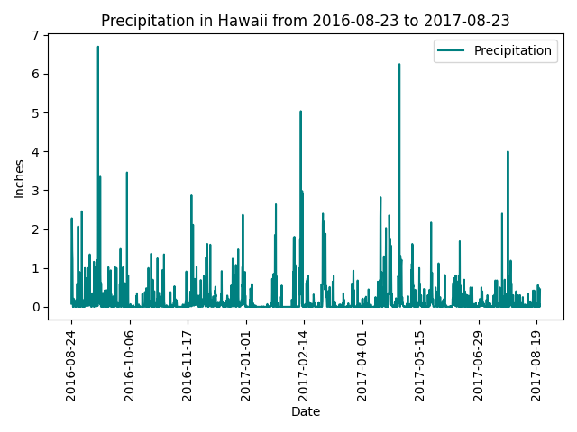
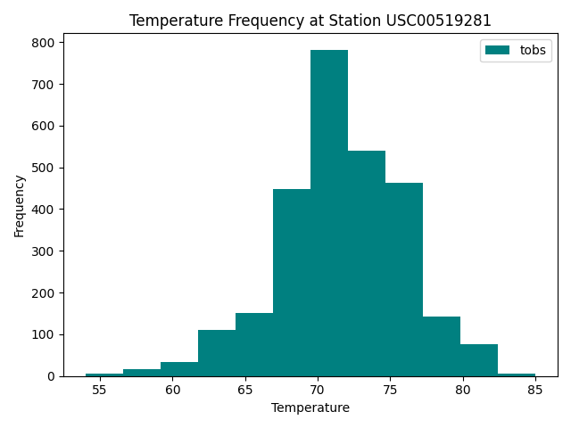

# SQLAlchemy Challenge

- [Project Structure](#project-structure)
- [Endpoints](#endpoints)
- [Images](#images)
- [Setup and Test](#setup--pytest)


### Project Structure

- `app.py`: Flask application setup and routes.
- `Model.py`: SQLAlchemy ORM setup and database reflection.
- `main.py`: Data analysis and visualization.
- `Resources/hawaii.sqlite`: SQLite database containing the climate data.
- `images/`: Directory to save generated plots.


### Endpoints

- `/api/v1.0/stations`: entire dataset
- `/api/v1.0/tobs`: temperature observations
- `/api/v1.0/precipitation`: entire dataset
- `/api/v1.0/<start>`: dynamic route
- `/api/v1.0/<start>/<end>`: dynamic route


### Images






### Setup & PyTest

```shell
# make sure you have pandas, flask, matplotlib, etc.
$ git clone https://github.com/constcorrectness/sqlalchemy-challenge.git
$ cd sqlalchemy-challenge

# 1. main.py (Part 1)
$ python main.py

# 2. Flask app (Part 2)
$ flask run

# 3. testing
$ pytest

```

